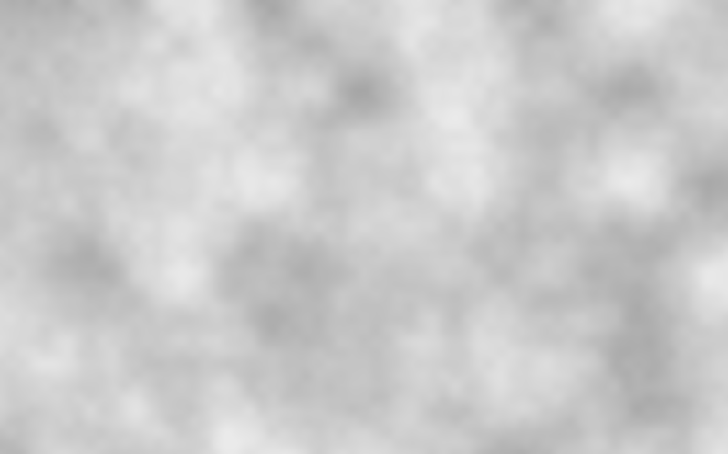

# JavaScript simulations of natural systems

This repository contains small, focused JavaScript simulations of natural and nature-inspired systems.
The goal is to explore how simple mathematical models and noise functions can be used to approximate natural phenomena such as clouds, fog, fluid-like motion, particle systems, and wave and moving patterns.

Each simulation is implemented as a minimal example using p5.js.

## 1. Perlin Noise

Perlin noise is a procedural noise function that generates smooth, continuous pseudo-random values instead of fully random, uncorrelated noise.
Unlike white noise, where neighboring pixels are completely unrelated, Perlin noise produces values that change gradually over space.
Because of this smoothness, it is widely used to approximate natural-looking patterns such as clouds, terrain heightmaps, marble textures, and fog.

In this project, Perlin noise is mapped to brightness to represent a density field.
Brighter areas correspond to higher “density” values and appear as clouds, while darker areas represent empty sky.
This simple mapping produces visually plausible cloud-like structures without any physical fluid simulation.

*Cloud-like pattern generated by mapping Perlin noise to pixel brightness*
